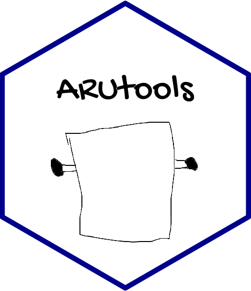

<!-- README.md is generated from README.Rmd. Please edit that file -->

# ARUtools 

<!-- badges: start -->

[](https://app.codecov.io/gh/dhope/ARUtools?branch=main)
<!-- badges: end -->

The goal of ARUtools is to facilitate the processing of ARU data. It
remains a development version for now.

## Installation

You can install the current version of ARUtools from
[GitHub](https://github.com/) with:

``` r
# install.packages("remotes")
remotes::install_github("dhope/ARUtools", build_vignettes=TRUE)
```

## Learn to use

If you have used `build_vignettes =T` on installation, you can check out
the vignettes using:

Current vignettes are: - Getting started with ARUtools: - Customizing
`clean_metadata()` : - Dealing with Timezones : - Working with spatial
data :

## Provide feedback

If you run into problems or have ideas for extensions, please don’t
hesitate to [submit an
issue](https://github.com/dhope/ARUtools/issues/new/choose).
